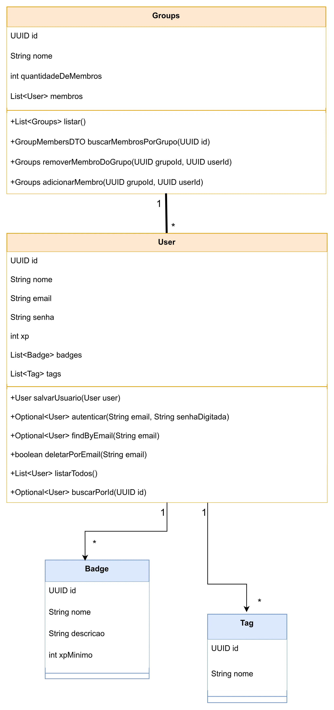

## **1\. Contexto**

### **1.1 Visão Geral**

A **API StudyBuddy** é um backend desenvolvido em Spring Boot com o objetivo de fornecer um sistema centralizado para gerenciamento de **usuários** e **grupos de estudo**.

Ela expõe endpoints REST utilizados pela aplicação frontend Next, permitindo fluxo de cadastro, autenticação e organização de grupos dentro da plataforma StudyBuddy.

### **1.2 Atores do Sistema**

| Ator | Função | Principais ações |
| --- | --- | --- |
| **Usuário** | Pessoa que utiliza o sistema | Criar conta, fazer login, participar de grupos |
| **Sistema (backend)** | Responsável por regras internas | Criptografia de senha, validação, controle de grupos |
| **Frontend** | Interface cliente | Envia requisições à API e exibe dados ao usuário |

### **1.3 Escopo**

✔ Implementado pelo backend + frontend :

- Usuários
- Autenticação
- Grupos
- Adicionar/Remover membros
- Listagens

❌ **Fora do escopo atual** (backend implementa parcialmente, mas frontend não usa):

- Tags
- Badges / Sistema de XP

### **1.4 Limites**

A API:

- Não envia notificações
- Não realiza chat entre usuários
- Não possui permissões avançadas por cargo
- Não inclui lógica de recomendação de estudos

A API serve exclusivamente como **núcleo operacional** para usuários e grupos.

* * *

## **2\. Funcionalidades da API**

### **2.1 Usuários**

- Criar usuário com criptografia BCrypt
- Autenticar (login)
- Buscar usuário por e-mail
- Deletar usuário por e-mail
- Listar todos os usuários
- Buscar usuário por UUID

### **2.2 Autenticação**

- Validação de e-mail + senha
- Comparação usando BCrypt
- Retorno de status correto para sucesso ou falha

### **2.3 Grupos**

- Criar grupos
- Listar grupos
- Buscar membros de um grupo
- Adicionar usuário a um grupo
- Remover usuário de um grupo
- Manter quantidade de membros sempre correta

### **2.4 Relacionamentos**

- Um usuário pode participar de vários grupos
- Um grupo contém vários usuários
- Não é permitido duplicar membros
- Não é permitido remover usuário que não pertence ao grupo

* * *

## **3\. Regras de Negócio**

### **3.1 Regras de Usuário**

1.  A senha deve ser armazenada criptografada com BCrypt.
2.  A senha deve conter no mínimo 8 caracteres
3.  Não é permitido criar usuário com e-mail já existente.
4.  Para login:
    - E-mail deve existir
    - Senha digitada deve coincidir com o hash armazenado
5.  Usuários podem ser removidos apenas pelo e-mail.
6.  Cada usuário é identificado por um **UUID único**.

* * *

### **3.2 Regras de Grupo**

1.  Todo grupo tem um UUID único.
2.  Só é possível adicionar usuário existente ao grupo.
3.  Usuário não pode ser adicionado duas veze**s** ao mesmo grupo.
4.  Não é possível remover usuário que não faz parte do grupo.
5.  A contagem de membros (`quantidadeDeMembros`) deve sempre refletir o tamanho real da lista de membros após qualquer operação.
6.  Ao listar membros, sempre retornar DTO sem expor senha do usuário.

* * *

### **3.3 Regras Gerais**

1.  Todas as operações devem retornar respostas REST consistentes.
2.  Erros devem usar status HTTP adequados (404, 400, 401, etc.).
3.  Dados sensíveis (senha) nunca podem ser devolvidos ao cliente.
4.  Operações críticas (delete, addMember, removeMember) devem ser transacionais.

* * *

## **4\. Requisitos Técnicos**

### **4.1 Backend**

| Item | Descrição |
| --- | --- |
| Linguagem | Java 21+ |
| Framework | Spring Boot 3+ |
| Segurança | BCryptPasswordEncoder |
| Banco de Dados | H2 ( |
| ORM | JPA |
| Build | Maven |
| API | REST com JSON |

* * *

### **4.2 Arquitetura**

- Camada **Controller** → recebe requisições HTTP
- Camada **Service** → regra de negócio
- Camada **Repository** → acesso ao banco
- Models anotados com `@Entity`
- DTOs para saída segura de dados

* * *

### **4.3 Dependências Principais**

- spring-boot-starter-web
- spring-boot-starter-data-jpa
- spring-boot-starter-security (para BCrypt)
- lombok 
- h2 

* * *

### **4.4 Requisitos de Deploy**

- Conexão JDBC configurada via environment variables
- Porta padrão: **8080**
- Build via `mvn package`
- Geração automática do schema pelo Hibernate

* * *

## **5\. Estrutura Atual do Sistema**

### **5.1 Modelo de Usuário (User)**

- id (UUID)
- nome
- email
- senha (criptografada)
- grupos (lista)

### **5.2 Modelo de Grupo (Groups)**

- id (UUID)
- nome
- membros (lista de usuários)
- quantidadeDeMembros (int)

* * *

## **6\. Fluxo dos Processos**

### **6.1 Fluxo — Criar Usuário**

1.  Frontend envia JSON
2.  API valida dados
3.  API criptografa senha
4.  Salva usuário
5.  Retorna usuário criado (sem senha)

### **6.2 Fluxo — Login**

1.  Usuario envia e-mail + senha
2.  Backend busca e-mail
3.  Compara hash usando BCrypt
4.  Retorna 200 (sucesso) ou 401 (falha)

### **6.3 Fluxo — Adicionar membro ao grupo**

1.  Recebe grupoId + userId
2.  Verifica se ambos existem
3.  Verifica duplicação
4.  Adiciona membro
5.  Atualiza quantidadeDeMembros
6.  Salva
7.  Retorna grupo atualizado

### **6.4 Fluxo — Remover membro**

1.  Verifica existência dos IDs
2.  Verifica se o usuário pertence ao grupo
3.  Remove
4.  Atualiza contador
5.  Salva

## 7 Diagrama de classes

